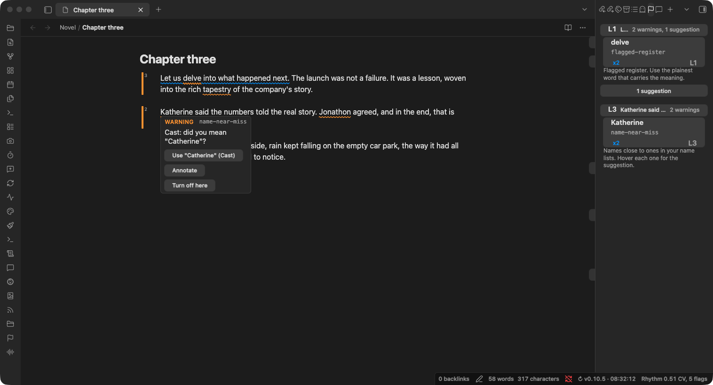

<!-- slop-check: off (names the AI-tell words the plugin flags, such as delve and leverage, as examples) -->
# Plumbline

[](https://github.com/ckelsoe/obsidian-plumbline/actions/workflows/ci.yml) [](https://github.com/ckelsoe/obsidian-plumbline/actions/workflows/release.yml) [](https://github.com/ckelsoe/obsidian-plumbline/releases) [](https://github.com/ckelsoe/obsidian-plumbline) [](https://obsidian.md) [](https://github.com/ckelsoe/obsidian-plumbline/blob/main/LICENSE) [](https://github.com/ckelsoe/obsidian-plumbline/releases/latest)

> [!WARNING]
> **Experimental.** Plumbline is in an experimental state. Its checks, defaults, and settings are subject to refinement or change based on feedback and real-world use. It flags, it never blocks or edits your prose on its own. If you hit a bug or a wrong flag, please [open an issue](https://github.com/ckelsoe/obsidian-plumbline/issues); early reports shape what gets refined first.

Flag AI-shaped writing, and check your prose against your own style guide, sources, and character names.

## What it does

Plumbline reads your prose and points at the places that read as machine-written, and at the places that break your own rules. It only reads. Nothing changes in a note unless you ask.



- **AI-tell checks.** A library of phrase checks (throat-clearing, hollow attribution, flagged register like "delve" and "leverage", summative closers, and more) plus cross-sentence heuristics (a negation set up only to be corrected, a repeated sentence opening, a bare "This shows...").
- **Checks against your own material.** Point Plumbline at your brand voice file, your interview transcripts, your Bible translations, or your character notes, and it flags banned terms, misquotes, and misspelled names. See [below](#check-your-prose-against-your-own-material).
- **Prose rhythm.** The status bar shows the note's burstiness: how much its sentence lengths vary, as a coefficient of variation. Human writing tends to vary its sentence length more than machine writing does, so a low number is worth a look.
- **It skips what is not yours to edit.** Code, headings, and frontmatter are always protected, so no check fires inside them and they do not skew the rhythm number. Quoted scripture is protected too in a group that draws on the scripture checks, such as the Devotional nonfiction starter.
- **Three ways to see a finding.** An inline underline on the phrase, a per-paragraph bar in the gutter colored by severity, and a side panel that groups findings by paragraph and ranks them. A strip beside the scrollbar shows where they sit in the whole note.
- **Groups and a check library.** A group is a named set of checks tuned for a kind of writing. Turn checks on or off, set each one's severity, confidence, and roll-up, and create your own phrase checks. Two read-only starters ship as worked examples to clone.
- **Per-note control.** Frontmatter and inline directives set a note's group, turn individual checks off, or skip a region entirely.
- **Readable on the filesystem.** A command writes each note's findings as JSON into `.plumbline/`, so a collaborator or an assistant working on the files sees the same findings you do.
- **AI disclosure for Kindle publishing.** Record how a chapter was made in a `provenance` frontmatter field (`cold`, `ai-edited`, or `ai-drafted`), and **Show AI disclosure for the active note** tells you which of Amazon KDP's AI categories it falls in and whether to disclose it at title setup.
- **Works with Annoteca.** Turn a finding into a comment thread. See [Annoteca integration](#annoteca-integration).

## Check your prose against your own material

Most writing has a source of truth outside the draft: a style guide, the interviews you are quoting, the translation you cite, the cast of a novel. Plumbline calls these **references**. A reference is a note or folder in your vault, and a group can use as many as it needs.

| Reference type | Use it for | Plumbline flags |
|---|---|---|
| Term list (voice or style file) | A brand voice, a house style guide, a product glossary, a client's banned words | A listed term, with a one-click replacement when the list names one |
| Quote source (any notes) | Interview transcripts, hearings, statutes, source documents | A quote that is not in the note it cites |
| Quote source (scripture layout) | Bible translations, one note per chapter | A quoted verse that does not match the translation word for word |
| Name list (people and places) | The characters and places in a novel or series | A name spelled a letter off, with the right name one click away |

To set one up:

1. Open **Settings > Plumbline > References**, click **New reference**, pick its type, and choose the note or folder. Plumbline reads it straight away and shows what it found, such as "42 terms, 30 with a replacement." or "12 names (3 aliases).", or what to fix.
2. Open **Manage groups**, pick the group you write with, and turn the reference on under **References**. A starter group can use a reference too; you do not need to copy it first.

Each kind of writing can have its own references: a devotional book, a company blog, and a novel can each use a different set. If you rename or move a reference, Plumbline follows it. When two term lists or name lists disagree, the hover shows every suggestion, each labelled with where it came from, and you choose.

The exact file formats and matching rules for every type are in [docs/references.md](./docs/references.md). A quick look at each:

**Brand voice.** A table with an "Avoid" column and a "Use instead" column, or bullets that open with a quoted phrase. An existing brand voice file in that shape works as it is.

```markdown
| Avoid    | Use instead |
|----------|-------------|
| utilize  | use         |
```

**Your own sources.** Cite the source note with a wikilink straight after the quote, or in a footnote.

```markdown
Dana said "we shipped late because QA was short" ([[2024-03-02 Interview]]).
```

**Scripture.** Cite the translation after the quote, as in `"The LORD is my shepherd" (Psalm 23:1, KJV)`. Plumbline ships no Bible text; the folder layout it expects is in [docs/references.md](./docs/references.md#quote-source-scripture-layout). Scripture also gets commands that count citations per translation and total the verses you quote against each publisher's quotation limit, and those two need no reference at all.

**Names in fiction.** One note per character or place, named for them (`Catherine.md`), with other spellings you use on purpose in its `aliases` frontmatter. "Katherine" or "Catharine" in your prose is then flagged.

## Installation

Plumbline is **not yet in the Obsidian community store**. While it is in early release, install it one of these two ways. Both need a published release, so if the steps below find nothing, a release has not been cut yet.

### BRAT (recommended while in early release)

BRAT installs and auto-updates a plugin straight from its GitHub releases.

1. Install the **BRAT** plugin from Community plugins.
2. Open BRAT settings and click **Add beta plugin**.
3. Enter `https://github.com/ckelsoe/obsidian-plumbline`.
4. Enable **Plumbline** in Settings, Community plugins.

### Manual

1. Download `main.js`, `manifest.json`, and `styles.css` from the [latest release](https://github.com/ckelsoe/obsidian-plumbline/releases/latest).
2. Create a folder named `plumbline` in your vault's `.obsidian/plugins/` directory.
3. Copy the three files into it.
4. Reload Obsidian and enable **Plumbline** in Settings, Community plugins.

### Community store

Once Plumbline is accepted into the Obsidian community store, you will be able to find it under Settings, Community plugins, Browse, by searching for **Plumbline**. It is not there yet.

## Annoteca integration

Plumbline pairs with [Annoteca](https://obsidian.md/plugins?id=annoteca), a commenting plugin for Obsidian. You can promote a finding into an Annoteca comment to discuss or answer it instead of only silencing it, and Plumbline's underline yields to an open comment so two plugins never mark the same passage at once. Full details in [docs/annoteca.md](./docs/annoteca.md).

## Community

Questions, ideas, and general discussion happen on [Discord](https://discord.gg/gd6tKJDPj4). For anything that needs tracking, a [GitHub issue](https://github.com/ckelsoe/obsidian-plumbline/issues) is still the better home. This is early software and reports are how it gets better. When you report a wrong flag, the note text that triggered it (or a small excerpt) helps a lot.

## Development

See [CONTRIBUTING.md](./CONTRIBUTING.md) for setup, quality gates, and conventions.

## License

MIT. See [LICENSE](./LICENSE).
